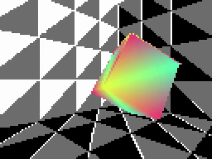

# Yeentooth Engine - A simple 3D game engine made for my A-Level Computer Science coursework.

### This is a simple game engine made with Python, Tkinter and Pygame. This is meant for demonstration rather than actual use (since I'm sure most people don't want their game to run sequentially on one cpu core), but if I make it faster in the future then maybe I'll use it for something.

## **Features:**

 * Object System

In Yeentooth, everything is built up of Abstracts. 
Abstracts are points in 3D space, which have a set of axes their children lie and move on. Scenes in Yeentooth games are heirachies of abstracts.

You can use abstract parenting to create movement systems quickly and easily, and you have fine control over both local and global coordinates.

 * Bespoke rendering engine

Yeentooth uses custom implementations of common graphical and mathematical functions, from matrix multiplication to triangle filling, ultimately built on top of Pygame. This makes it easier to modify and expand apon depending on your needs.

## **Planned features**

 * ~~Graphical User Interface~~

~~At the moment you have to instantiate and manage everything in your scene through code, but I'm working on a scene management interface which should make producing your game as easy as possible~~
I've scrapped this because it was taking too long and I wasn't enjoying making it, so I'm going to make a simple command line interface for the editor functions instead. You'll still have a viewport and you'll be able to see the changes you make.

 * Abstract script attachments

Attatching user-written scripts to objects is generally a given in most game ingines, so this is definitely on my radar.

 * Basic audio, collision and raycast systems

These are arguably fundamental building blocks for most games, so these are in production as well.

 * Import/Export process

Abstract heirachies will be able to be exported as Hyperstract (.hstrct) files, which can then be instantiated into other heirachies, which ultimately mesh together into your game.

## Just to note, I'm probably only going to do as much of the above that's required to get the marks I need. That being said, working on this project has been pretty fun, so I *might* continue on it in the future, time allowing.

