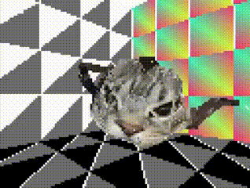

# Yeentooth Engine - A simple 3D game engine made for my A-Level Computer Science coursework.

### This is a simple game engine made with Python, Tkinter and Pygame. This is meant for demonstration rather than actual use (since I'm sure most people don't want their game to run sequentially on one cpu core), but if I make it faster in the future then maybe I'll use it for something.

it runs faster than this i swear 😭

## **Info:**

In Yeentooth, everything is built up of Abstracts. 
Abstracts are points in 3D space, which have a set of axes their children lie and move on. Scenes in Yeentooth games are essentially trees of abstracts, which you can initialise and program in a Python file.

You get fine control over the gameloop, as you create and manage it for each of your scenes. This would probably be easier if I had any documentation for it, but it's only 1500 lines of code to reverse engineer you'll figure it out

While admittedly there aren't many high-level features built in yet, you can import uv-mapped wavefront (.obj) models and apply textures to them, and you can use all of Pygame's built in features ontop of Yeentooth's render pipeline.

For rendering, Yeentooth uses custom (aka slow ☠️) implementations of common graphical and mathematical functions, from matrix multiplication to triangle filling, built using Pygame's graphics engine. This makes it easier to modify and expand apon depending on your needs if you want to do something specific

But yeah, if you want to then have a play around with it! You can run and look through the Sample Scene to see how everything works, and use it as a basis for your own game. If you make anything using this, don't hesitate to show me! I'd love to see what you guys are capable of doing with this 👍
